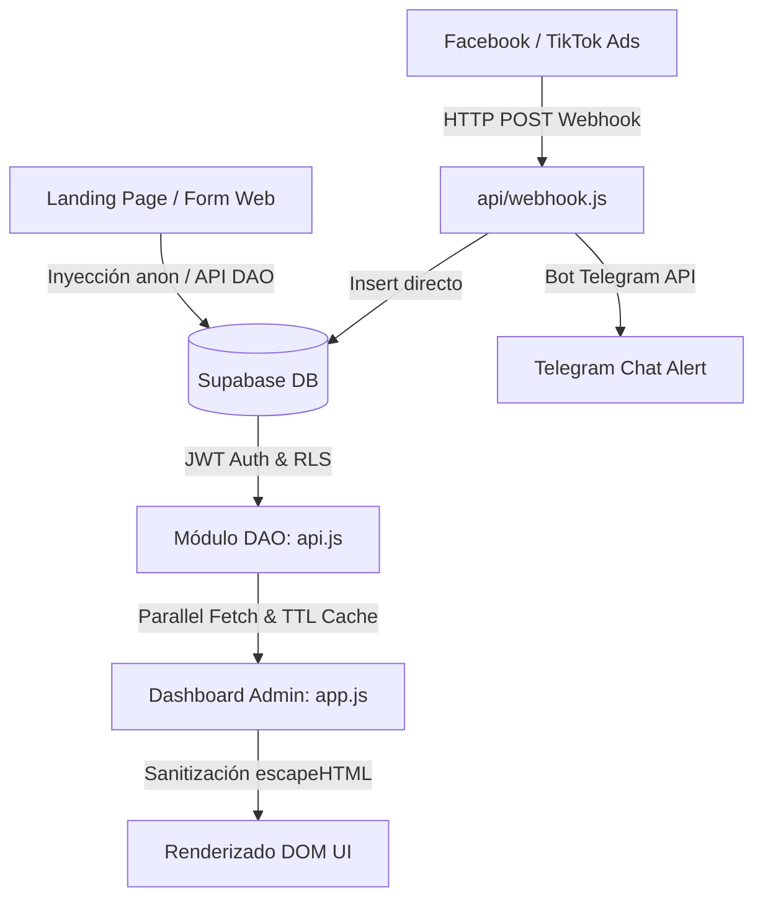

# 📘 Manual Técnico, Arquitectura Modular y Guía de Seguridad — Norte Chico

> [!IMPORTANT]
> **ENTORNO DE PRODUCCIÓN Y REPOSITORIO GITHUB**
> Este repositorio corresponde al **ambiente de Producción** del proyecto (`PRODUCCION WEB INMOBILIARIA`), conectado a GitHub (`castaneda-dev/inmobiliaria-norte-chico`) y desplegado en Vercel (`banka.cl`). **Las variables y credenciales sensibles (tokens de Telegram, claves de Supabase, etc.) deben gestionarse exclusivamente mediante Variables de Entorno en Vercel / `.env.local` y NUNCA ser commiteadas en código duro.**

---

## 📑 Tabla de Contenidos
1. [Principios de Arquitectura Modular y Regla de Oro](#1-principios-de-arquitectura-modular-y-regla-de-oro)
2. [Mapa de Módulos del Sistema y Código Fuente](#2-mapa-de-módulos-del-sistema-y-código-fuente)
3. [Comunicación Inter-Módulos y Flujo de Datos](#3-comunicación-inter-módulos-y-flujo-de-datos)
4. [Módulo Core y Dependencias Compartidas](#4-módulo-core-y-dependencias-compartidas)
5. [Arquitectura Frontend & Dashboard Admin](#5-arquitectura-frontend--dashboard-admin)
6. [Backend Serverless: Webhook CRM & Telegram](#6-backend-serverless-webhook-crm--telegram)
7. [Estrategias de Rendimiento, Caché y Optimización de Imágenes](#7-estrategias-de-rendimiento-caché-y-optimización-de-imágenes)
8. [Estrategias de Ciberseguridad y Políticas RLS](#8-estrategias-de-ciberseguridad-y-políticas-rls)
9. [Guía de Compilación, Minificación y Mantenimiento](#9-guía-de-compilación-minificación-y-mantenimiento)

---

## 1. Principios de Arquitectura Modular y Regla de Oro

El proyecto está diseñado bajo una **arquitectura modular estricta**, donde cada componente posee una responsabilidad única y fronteras bien definidas para garantizar mantenibilidad, seguridad y rendimiento.

> [!IMPORTANT]
> ### 🏆 Regla de Oro para Futuros Desarrollos
> Cualquier código, función o nueva característica que se agregue al proyecto en el futuro **deberá respetar estrictamente esta separación modular**.
> *Ejemplo*: Si se implementa un nuevo módulo de pagos, facturación o reportes avanzados, **NO debe acoplarse en módulos ya existentes** a menos que sea una refactorización o mejora específica de ese módulo. Se debe crear su propio espacio o controlador dedicado.

---

## 2. Mapa de Módulos del Sistema y Código Fuente

A continuación se detalla cada módulo del sistema, su responsabilidad y los bloques de código clave precedidos por su ruta exacta de archivo.

### 2.1. Módulo Core / Configuración Global
- **Responsabilidad**: Inicialización centralizada de servicios base (Supabase) y provisión del cliente global para toda la aplicación.
- **Ubicación**: `supabase_config.js` / `src/lib/supabaseClient.js`

```javascript
// Ruta de archivo: PRODUCCION WEB INMOBILIARIA / supabase_config.js
const SUPABASE_URL = process.env.NEXT_PUBLIC_SUPABASE_URL || "https://jlgnqiedkagkcqoakmom.supabase.co";
const SUPABASE_ANON_KEY = process.env.NEXT_PUBLIC_SUPABASE_ANON_KEY || "eyJhbGciOiJIUzI1NiIsInR5cCI6IkpXVCJ9...";

window.supabaseClient = null;

if (typeof supabase !== 'undefined' && SUPABASE_URL !== "TU_SUPABASE_URL_AQUI") {
    window.supabaseClient = supabase.createClient(SUPABASE_URL, SUPABASE_ANON_KEY);
    console.log("✅ Cliente de Supabase conectado en tiempo real.");
}
```

---

### 2.2. Módulo de Capa de Datos / DAO (Data Access Object)
- **Responsabilidad**: Encapsular todas las llamadas a la base de datos (CRUD) para propiedades, clientes, agentes e interacciones. Aislar la lógica de red del renderizado visual.
- **Ubicación**: `assets/js/api.js`

```javascript
// Ruta de archivo: PRODUCCION WEB INMOBILIARIA / assets/js/api.js
window.api = {
    async fetchProperties() {
        if (!supabaseClient) return [];
        try {
            const { data, error } = await supabaseClient.from('propiedades').select('*').order('id', { ascending: false });
            if (error) throw error;
            return data || [];
        } catch (e) {
            console.error("Error fetching propiedades:", e);
            return [];
        }
    },
    async saveProperty(payload, id = null) {
        if (!supabaseClient) return null;
        try {
            let res = id 
                ? await supabaseClient.from('propiedades').update(payload).eq('id', id)
                : await supabaseClient.from('propiedades').insert([payload]);
            if (res.error) throw res.error;
            return true;
        } catch (e) {
            console.error("Error saving propiedad:", e);
            return false;
        }
    },
    async fetchClients() {
        if (!supabaseClient) return [];
        try {
            const { data, error } = await supabaseClient.from('clientes').select('*').order('id', { ascending: false });
            if (error) throw error;
            return data || [];
        } catch (e) {
            console.error("Error fetching clientes:", e);
            return [];
        }
    }
};
```

---

### 2.3. Módulo Landing Page Pública
- **Responsabilidad**: Presentación pública del catálogo de bienes raíces, carrusel visual HD, filtros de búsqueda para compradores y captura directa de leads.
- **Ubicación**: `index.html` y `assets/js/index-app.js`

```javascript
// Ruta de archivo: PRODUCCION WEB INMOBILIARIA / assets/js/index-app.js
document.addEventListener('DOMContentLoaded', async () => {
    // Carga de inventario publico usando el modulo DAO
    const propiedades = await api.fetchProperties();
    renderPublicCatalog(propiedades);
});
```

---

### 2.4. Módulo Dashboard de Administración / Estructura Modular Frontend
- **Responsabilidad**: Gestión privada del CRM desglosada en sub-módulos especializados bajo `assets/js/modules/` con `app.js` actuando como orquestador ligero:
  - **`assets/js/modules/toast.module.js`**: Notificaciones flotantes estilo glassmorphism (`Toast.success`, `Toast.error`, etc.).
  - **`assets/js/modules/auth.module.js`**: Auth Guard, Rate Limiting y temporizador debounced de 10 minutos.
  - **`assets/js/modules/router.module.js`**: Navegación optimista entre vistas y control responsive de sidebar.
  - **`assets/js/modules/renderers.module.js`**: Renderizado de KPIs, gráficos SVG, tarjetas de inventario y sanitización XSS.
  - **`assets/js/modules/modals.module.js`**: Controladores CRUD para formularios y modales con compresión de imágenes HD.
- **Ubicación Orquestadora**: `assets/js/app.js`

```javascript
// Ruta de archivo: PRODUCCION WEB INMOBILIARIA / assets/js/app.js
// Orquestador ligero que delega la ejecucion a los sub-modulos especializados
window.switchView = (viewId, element) => window.RouterModule?.switchView(viewId, element);
window.checkSupabaseSession = () => window.AuthModule?.checkSupabaseSession();
window.renderDashboard = () => window.RenderersModule?.renderDashboard();
window.openModal = (id) => window.ModalsModule?.openModal(id);
```


---

### 2.5. Módulo Backend Serverless (Webhooks & Notificaciones)
- **Responsabilidad**: Endpoint HTTP POST en la nube que ingesta webhooks de publicidad (Facebook Lead Ads, TikTok Ads, JSON), registra los clientes en Supabase y dispara notificaciones instantáneas a Telegram.
- **Ubicación**: `api/webhook.js`

```javascript
// Ruta de archivo: PRODUCCION WEB INMOBILIARIA / api/webhook.js
const { createClient } = require('@supabase/supabase-js');
const supabase = createClient(process.env.SUPABASE_URL, process.env.SUPABASE_ANON_KEY);

module.exports = async function handler(req, res) {
    if (req.method !== 'POST') return res.status(405).json({ error: 'Method not allowed' });
    
    // Parseo multiformato (Facebook Ads / TikTok / JSON)
    const { nombre, telefono, email, origen, tipoInteres } = parseLeadPayload(req.body);

    // Insercion directa en la base de datos
    await supabase.from('clientes').insert([{
        nombre_completo: nombre,
        telefono: telefono,
        email: email,
        origen: origen,
        tipo_interes: tipoInteres,
        estado_lead: 'Nuevo'
    }]);

    // Notificacion automatica a Telegram API
    await sendTelegramAlert({ nombre, telefono, email, origen });
    return res.status(200).json({ success: true });
};
```

---

### 2.6. Módulo de Base de Datos & Seguridad RLS
- **Responsabilidad**: Definición de tablas, relaciones, índices y políticas granulares de acceso Row Level Security (RLS) para proteger los datos contra lecturas no autorizadas.
- **Ubicación**: `inmobiliaria_crm.sql`

```sql
-- Ruta de archivo: PRODUCCION WEB INMOBILIARIA / inmobiliaria_crm.sql
ALTER TABLE propiedades ENABLE ROW LEVEL SECURITY;
ALTER TABLE clientes ENABLE ROW LEVEL SECURITY;

-- Acceso completo solo a usuarios autenticados del Dashboard
CREATE POLICY "Permitir todo a usuarios autenticados" ON propiedades FOR ALL TO authenticated USING (true);
CREATE POLICY "Permitir todo a usuarios autenticados" ON clientes FOR ALL TO authenticated USING (true);

-- Permitir insercion publica anonima para capturar leads
CREATE POLICY "Permitir insercion publica de leads" ON clientes FOR INSERT TO anon WITH CHECK (true);
```

---

### 2.7. Módulo de Build, Optimizaciones & Asset Pipeline
- **Responsabilidad**: Automatización de tareas de compilación: minificación de CSS/JS, optimización HD de imágenes WebP y ofuscación Nivel B del código de producción.
- **Ubicaciones**:
  - `minify_assets.py`
  - `scripts/optimize_images.py`
  - `scripts/obfuscate.js`

```python
# Ruta de archivo: PRODUCCION WEB INMOBILIARIA / minify_assets.py
import csscompressor, jsmin

def minificar_archivos():
    # Procesa index.css -> index.min.css, app.js -> app.min.js
    pass
```

---

## 3. Comunicación Inter-Módulos y Flujo de Datos

El flujo de información en el sistema sigue un patrón declarativo y desacoplado:



1. **Captura de Datos Externa**: Leads provenientes de redes sociales ingresan a `api/webhook.js`, el cual registra los datos en Supabase e informa en tiempo real a Telegram.
2. **Captura de Datos Interna**: La Landing pública interactúa con Supabase a través del cliente ligero `supabase_config.js` y `api.js`.
3. **Consumo y Control**: El Dashboard de Administración invoca la capa DAO (`api.js`) exponiendo el objeto global `window.api`. Las llamadas de lectura se ejecutan en paralelo (`Promise.all`) con caché en memoria (30 segundos TTL).
4. **Invalidación de Caché**: Cada operación de escritura (`saveProperty`, `deleteClient`) ejecutada desde la DAO invalida automáticamente la memoria para asegurar consistencia de datos.

---

## 4. Módulo Core y Dependencias Compartidas

El sistema comparte dos recursos globales centralizados que sirven de cimiento para todos los módulos:

1. **`window.supabaseClient` (`supabase_config.js`)**: Instancia singleton compartida que permite la conexión autenticada a la infraestructura en la nube.
2. **`window.api` (`assets/js/api.js`)**: Capa DAO unificada de donde leen tanto la Landing Page como el Dashboard Admin.

---

## 5. Arquitectura Frontend & Dashboard Admin

El Dashboard Admin implementa las siguientes capas internas de protección y rendimiento:

- **Auth Guard DOM (`#appShell`)**: El contenedor principal de la interfaz se mantiene en `display: none` hasta validar el token JWT de la sesión.
- **Rate-Limiting de Autenticación**: Máximo 5 intentos fallidos consecutivos en el login. Superado el límite, se impone un bloqueo temporal de 2 minutos.
- **Temporizador de Inactividad**: Registra eventos de usuario (`mousemove`, `keydown`). A los 9 minutos emite una alerta y a los 10 minutos destruye la sesión mediante `supabaseClient.auth.signOut()`.
- **Sanitización Anti-XSS**: Todos los renderizadores (`renderProperties`, `renderClients`, `renderAgents`) pasan el texto por la función `escapeHTML()` antes de inyectarlo en el DOM.

---

## 6. Backend Serverless: Webhook CRM & Telegram

El módulo serverless `api/webhook.js` cuenta con resiliencia de datos:
- Detecta automáticamente la estructura de la carga útil (Payload) sea de Facebook Lead Ads (matriz `field_data`), TikTok Ads o JSON genérico.
- Extrae dinámicamente: `nombre`, `telefono`, `email`, `origen` e `interés`.
- Genera una alerta formateada en Markdown hacia la API oficial de Telegram.

---

## 7. Estrategias de Rendimiento, Caché y Optimización de Imágenes

1. **Navegación Optimista**: Transición inmediata entre pestañas visuales (< 50ms) sin esperar las respuestas de red.
2. **Caché en Memoria (TTL 30s)**: Previene solicitudes redundantes a Supabase si el usuario navega frecuentemente entre pestañas.
3. **Optimización de Imágenes HD (`scripts/optimize_images.py`)**:
   - Presets WebP con muestreo Lanczos para resolución 4K/Retina.
   - Reducción del peso de imágenes entre **90% y 95%**.
   - Aceleración gráfica en CSS mediante `image-rendering: -webkit-optimize-contrast`.

---

## 8. Estrategias de Ciberseguridad y Políticas RLS

| Capa | Mecanismo | Descripción |
|---|---|---|
| **Aislamiento DOM** | Auth Guard `#appShell` | Evita destellos de contenido privado sin token JWT válido. |
| **Row Level Security** | RLS en Supabase | Lectura/Escritura en base de datos restringida únicamente a roles `authenticated`. |
| **Protección HTTP** | `vercel.json` | Incluye `X-Frame-Options: DENY`, `X-Content-Type-Options: nosniff` y `Permissions-Policy`. |
| **Ofuscación JS** | `scripts/obfuscate.js` | Protege los scripts públicos mediante `javascript-obfuscator` (Nivel B). |

---

## 9. Guía de Compilación, Minificación y Mantenimiento

### Comandos de Compilación Local:

1. **Minificación de CSS y JS**:
   ```bash
   python minify_assets.py
   ```
2. **Compresión de Imágenes WebP**:
   ```bash
   python scripts/optimize_images.py
   ```
3. **Ofuscación de Código JavaScript Público**:
   ```bash
   node scripts/obfuscate.js
   ```

---
*Documentación técnica interna y especificación modular para la plataforma Inmobiliaria Norte Chico.*
